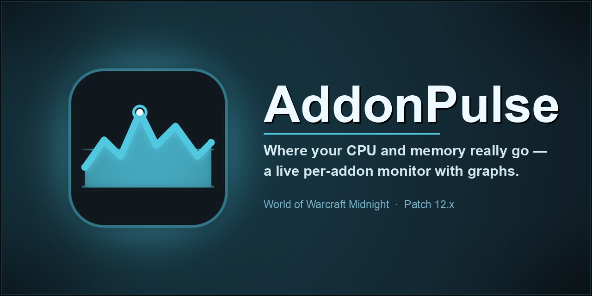
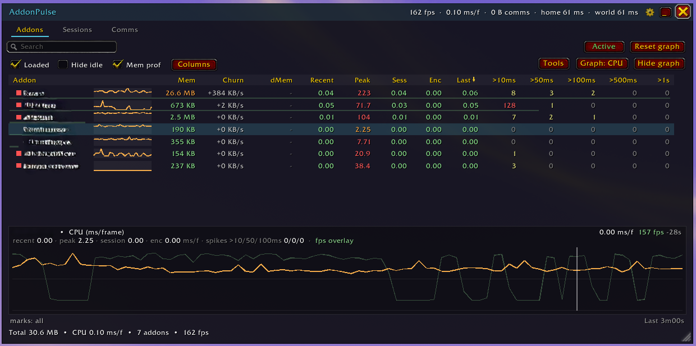
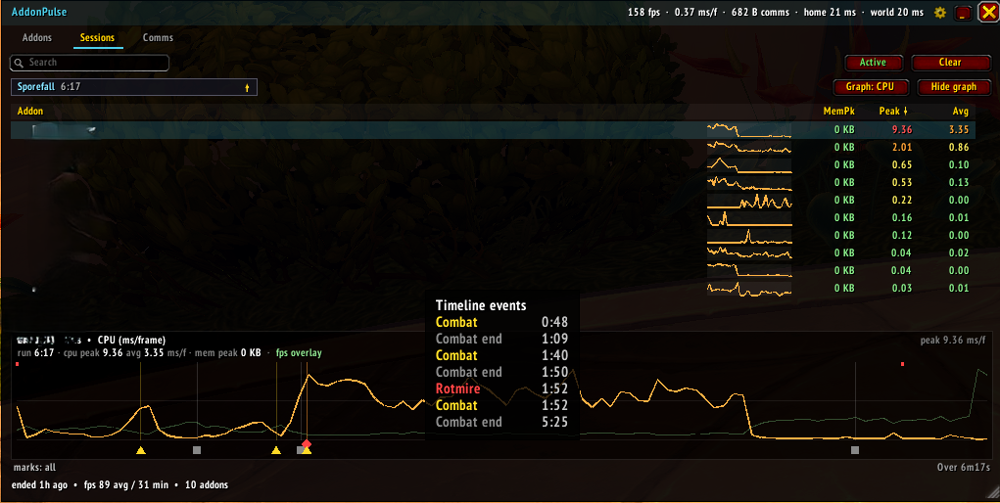
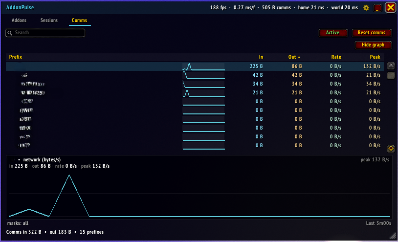
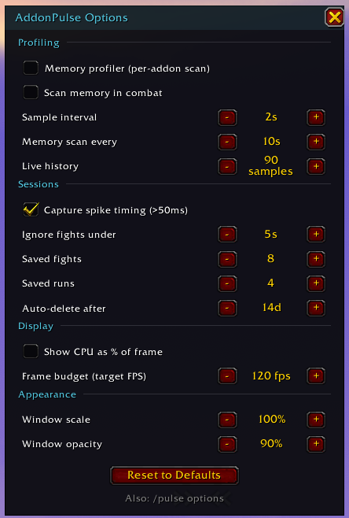

# AddonPulse

A live CPU and memory monitor for every addon you have installed. Open it, and
you get a sortable, filterable table of where your memory and CPU time are
actually going — recent / peak / session / encounter CPU per addon, a per-addon
history graph, leak and spike flags, and addon-comms traffic.

It also **keeps recording while closed or minimised**, and snapshots every
fight — and every whole dungeon/raid — so you can close the window during a
pull and open it afterwards (even after a reload) to review on the **Sessions**
tab.

## Tabs

AddonPulse has three tabs that share one table:

### Addons

| Column | Meaning |
| --- | --- |
| **Addon** | The addon's folder name (its real title is in the tooltip). Two status dots may sit to its left — see below. |
| **Mem** | Current Lua memory the addon is holding, in KB / MB. |
| **Recent** | CPU ms per **frame**, averaged over the last 60 frames — the live load. ~16.7 ms is a *whole* frame at 60 fps, so over ~1 ms/frame is a real slice. |
| **Peak** | The worst single frame this session. |
| **Sess** | Average per frame across the whole session. |
| **Enc** | Average per frame during the current boss encounter. |

These come from Blizzard's native profiler; click any header to sort. Each row
also has a **sparkline** (CPU or memory, matching the **Graph: CPU / Mem**
toggle) and an inline severity bar.

The columns above are the defaults — the **Columns** button picks which to show
from a wider set: **Mem, Churn** (memory growth/s), **dMem** (memory change since
a baseline — see Tools below), **Recent, Peak, Session, Encounter, Last**, and the
spike counts **>10ms / >50ms / >100ms / >500ms / >1s** (how many frames the addon
ran over each threshold this session). Showing more columns reads a bit more from
the profiler; showing fewer reads less.

CPU figures are in **ms/frame** by default; flip Options → Display → **Show CPU
as % of frame** to read them as a percentage of one frame's budget instead.

**Right-click** any row to **pin** it to the top (it gets a teal edge marker) or
**ignore** it (hidden from the list). The **Tools** button holds a **memory
baseline**: click *Set baseline* to snapshot every addon's memory, and the
**dMem** column then shows how much each has grown or shrunk since — ideal for
catching a leak over a long session. Tools → **Show ignored** brings ignored rows
back (dimmed) so you can un-ignore them. The baseline is **per character** (your
alts load different addons), while pin/ignore lists are shared account-wide.

**Status dots** (left of the name):

- 🟠 **orange — possible memory leak**: memory is climbing steadily rather than
  sawtoothing up and down with normal garbage collection.
- 🔴 **red — CPU spike**: the addon has used over 10 ms in a single frame at
  some point this session.

Click a row to pin it to the **detail graph**, which plots its history and lists
its full stat block (peak / session / encounter, spike counts, memory
peak / avg / churn).

The graph is **annotated**. Events show as distinct shapes in a lane just below
the plot — a **triangle** for combat start, **square** for combat end, **diamond**
for a boss pull, and **✕** for a death (each colour-coded too) — with a faint
guide line up into the chart. **Hover the lane** for a list of every event with
its time, which keeps a cluster of events around the same moment readable. **Red ticks along the top** mark each interval the addon had
a **frame over 50 ms** (so you see *when* it stuttered, which the averaged line
hides), and **hovering** the plot shows a crosshair with the exact value (plus the
**FPS** at that moment) and the time at that point. A faint green **FPS line** is overlaid
on the graph, so you can line an addon's CPU spike up against the frame-rate dip.
Markers are stored with saved sessions too. The strip below the
graph cycles markers **all → pulls + deaths → off** (to cut clutter on long
runs) and shows the graph's time window (e.g. `Last 3m00s`, or the session
length).

### Sessions

Saved snapshots of past **fights** and **runs**. Pick one from the **dropdown**
at the top (newest first) — it shows each session's name, duration and how long
ago it was, and is **searchable** by name (handy for jumping to a specific boss):

- A **fight** is one combat segment — named after the boss when there was an
  encounter, otherwise "Combat". Boss fights are tagged with their **difficulty**
  (N / H / M / LFR) and **Kill / Wipe** result.
- A **run** is one whole dungeon or raid, recorded from the moment you zone in
  until you leave — trash and bosses together. Mythic+ runs show their **key
  level** (and affixes).

Every session also records the **frame rate** over time — the footer shows the
avg / min, and the graph overlays a faint green **FPS line**, so you can see an
addon's CPU spike line up with the actual frame-rate dip. It also captures the
**addon comms** that flowed during the session: the footer shows the total in /
out, and hovering the session selector lists the **top prefixes** (so you can see
that a pull moved, say, 2 MB of traffic, mostly from BigWigs).

Each row shows that addon's CPU **peak / average** and memory peak for the
session, and the tooltip adds how many frames it went over **10 / 50 / 100 ms
during that fight**; click a row to graph its full timeline. **Clear** removes
the shown snapshot.

Sessions are **saved across reloads and logouts** and are **per character** (a
fight on your warrior won't mix with your mage's), so the reload after a raid or
M+ keeps them. The addon keeps the last 8 fights and 4 runs (and auto-drops any
older than `sessionMaxDays`, default 14, so the file can't grow forever). Within
each it keeps the addons that were notable (any real CPU, or ≥3 MB) — up to 40 —
each with its full timeline and **spike ticks**, so every row has a graph. An
*in-progress* run is also saved at logout and **resumes when you re-enter the
instance**, so reloading mid-key doesn't lose it.

### Comms

Per-prefix addon-message traffic, captured from `SendAddonMessage` and
`CHAT_MSG_ADDON`. Columns: **In / Out** (total bytes), **Rate** (current
bytes/sec) and **Peak** (the burstiest second this session) — so a sync storm
floats to the top when you sort by Peak. Click a row for a **traffic graph**
(bytes/sec over time) with a sparkline on every row, and hover for a **channel
breakdown** (Party / Raid / Guild / Whisper / Instance), the **average message
size**, and the message rate.

Prefixes almost always identify the sending addon. (Incoming is only visible for
prefixes registered on your client; outgoing is always counted. Bytes are
`#prefix + #message` — a close stand-in for what goes on the wire.)

## Using it

- **Open / close:** `/pulse` (also `/addonpulse`, `/ap`), left-click the minimap
  button, or the addon-compartment entry under the minimap.
- **Pause / resume:** the **Active / Paused** button, **right-click** the minimap
  button, or `/pulse off` · `/pulse on`.
- **Switch tabs:** click **Addons / Sessions / Comms** under the title.
- **Sort:** click any column header. Click again to reverse.
- **Filter:** type in the search box to match by name/prefix. On the Addons tab,
  toggle **Loaded only** and **Hide idle**.
- **Pin / ignore:** right-click an Addons row to pin it to the top or hide it;
  the **Tools** button sets a memory baseline and reveals ignored rows.
- **Graph:** click an Addons or Sessions row to pin it. **Graph: CPU / Mem**
  switches the plotted series; **Hide graph** collapses it. The live graph holds
  ~3 minutes; a session graph holds the whole fight or run.
- **Minimise:** the **_** button shrinks the window to just its title bar — and
  narrows it to a compact ~600px stats bar (or wider if your selected stats need
  it); **+** restores the full window. Recording keeps running while minimised.
- **Bar stats:** the **cogwheel** in the title bar picks which quick readouts —
  **FPS / CPU / Memory / Comms / Home & World latency** — show on the bar. They
  stay live even while minimised (and even while **paused**), so the collapsed
  bar works as a compact monitor on its own.
- **Move / resize:** drag the title bar to move, drag the bottom-right grip to
  resize. Position, size, tab and all view settings are saved.

## Recording

While **enabled (Active)**, AddonPulse samples every 2 seconds **all the time** —
even while the window is closed or minimised — so the live history keeps filling
and fights/runs are captured. The **Active / Paused** toggle is the single on/off
for all of that background work (see below).

- A **fight** is one combat segment (entering to leaving combat), named after
  the boss if an encounter started during it, and ignored if it's only a few
  seconds.
- A **run** is one dungeon/raid visit (zone in to zone out), recorded the whole
  time so it covers trash and bosses.

**Pause** AddonPulse (the **Active / Paused** button, right-click the minimap, or
`/pulse off`) to drop the heavy part — no new per-addon sampling and no
auto-recording. Everything you've **already** captured stays viewable, though:
saved **sessions**, **comms**, the existing **graphs**, and the last live Addons
snapshot all still open (the footer just shows `paused` so you know the
per-addon numbers are frozen). The lightweight **title-bar stats keep running**
live, so paused mode also doubles as a cheap FPS / CPU / Memory bar. (Blizzard's
native CPU profiler is always on and can't be disabled — pausing stops
AddonPulse's per-addon work, not the profiler.) Closing the window stops even the
bar; combat/instances only auto-record while enabled.

## CPU source

CPU comes from Blizzard's native **`C_AddOnProfiler`**, which is always on — no
console variable, no reload. That's what gives you the recent / peak / session /
encounter metrics and the spike counts, all in ms per frame.

(On pre-12.0.7 clients without the native profiler, AddonPulse falls back to the
old cumulative meter, which needs `scriptProfile` + a reload; the **CPU** button
appears only in that case.)

**Reset graph** (Addons tab) clears the live CPU + memory sparkline / graph
history. It can't zero the **Peak / Sess / Enc** columns — those come from the
game's native profiler and repopulate on the next frame, so only a `/reload`
clears them. **Reset comms** (Comms tab) clears traffic counts.

## A note on "process"

WoW runs the entire interface — every addon — inside a single Lua state in one
client process. There are no per-addon OS processes, so AddonPulse reports usage
**per addon**, which is the finest granularity the client exposes. Memory used
by a shared library is billed to whichever addon's code was running when the
allocation happened, so a heavy library can make its *caller* look expensive.

## Performance

AddonPulse is built to stay cheap:

- The sampler is a `C_Timer` ticker, not a per-frame `OnUpdate` — it wakes once
  per interval (2 s by default) and does **no per-frame work**.
- While the window is **closed or minimised**, each tick reads only `recent`
  CPU per addon (just enough to keep history and capture sessions); the other
  profiler metrics and the leak scan are skipped. The full set is read only while
  the table is on screen.
- Per-addon **memory** uses `UpdateAddOnMemoryUsage()`, which walks every addon
  and is expensive, so it's refreshed on a slow cadence (`memSeconds`, default
  10 s) and **only while the window is on screen**. That scan is the one thing
  AddonPulse does that can register as a CPU spike — so if you only care about
  CPU, untick **Mem prof** on the Addons tab to skip it entirely (the title-bar
  Memory readout still works; it uses cheap total-UI memory). The CPU side is
  always cheap regardless (the native profiler costs microseconds).
- That walk **can't be made asynchronous** — WoW's Lua is single-threaded and
  `UpdateAddOnMemoryUsage()` is one atomic, blocking call, so wherever it runs it
  costs a full frame. AddonPulse therefore keeps it **out of combat by default**,
  where a one-off hitch is invisible; per-addon memory simply holds during a
  fight and refreshes the instant it ends. Power users can re-enable in-combat
  scanning via Options → Profiling → **Scan memory in combat**.
- The table repaints only while the window is open.
- Saved sessions are bounded (top ~40 notable addons each), so the
  saved-variables file stays reasonable. The active run is written once, at logout.

For near-zero cost, **pause** AddonPulse (Active/Paused) — that stops all the
background sampling and recording, leaving only the lightweight title-bar stats
while the bar is visible.

## Options

The **cog menu → Options...**, `/pulse options`, or **Game Menu → Options →
AddOns → AddonPulse** opens a panel for everything with a default, with a
**Reset to Defaults** button:

| Setting | What it does |
| --- | --- |
| **Memory profiler** | The heavy per-addon memory scan. Off = CPU-only, much lighter. |
| **Scan memory in combat** | Off (default) pauses that scan during combat so it can't spike a frame mid-fight; numbers refresh when combat ends. |
| **Sample interval** | How often the sampler wakes (1–10 s). Higher is cheaper. |
| **Memory scan every** | Cadence of the memory walk while the window is open (5–60 s). |
| **Live history** | Samples kept for the live graph/sparkline (30–300). |
| **Capture spike timing** | Record *when* >50ms spikes happen during fights (for the session-graph ticks). Off trims a few profiler reads per tick while recording; the per-fight spike *counts* still work either way. |
| **Ignore fights under** | Combat shorter than this isn't saved (1–30 s). |
| **Saved fights / runs** | How many past sessions of each to keep. |
| **Auto-delete after** | Drop saved sessions older than N days (0 = keep until the caps push them out). |
| **Show CPU as % of frame** | Display CPU as a percentage of one frame's budget instead of ms. |
| **Frame budget (target FPS)** | The FPS that defines 100% for the % display (default 60). |
| **Window scale / opacity** | Size and background opacity of the window. |

Changes apply immediately and stay in sync with the in-window toggles. **Reset to
Defaults** restores these tunables (it leaves your pin/ignore lists and saved
sessions alone).

## Slash commands

| Command | Action |
| --- | --- |
| `/pulse` | Toggle the window. |
| `/pulse on` · `off` · `toggle` | Enable / pause AddonPulse (the off switch for all background work; the title-bar stats keep running). |
| `/pulse options` | Open the options window. |
| `/pulse reset` | Clear the live CPU + memory graph history (not the native Peak/Sess columns — those need `/reload`). |
| `/pulse status` | Print the enabled / profiler state. |
| `/pulse cpu` | (Legacy) toggle the `scriptProfile` meter — only does anything on pre-12.0.7 clients. |
